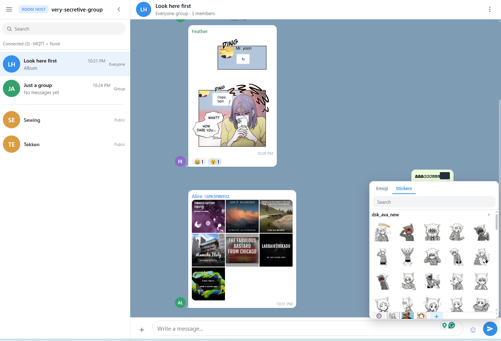

# Telegio

Browser peer-to-peer chat. No server stores messages — peers connect over WebRTC (Trystero / MQTT + Nostr signaling). Static site; works on GitHub Pages.



## Run locally

```bash
npx --yes serve .
```

Open the URL it prints (HTTPS or `localhost`).

Live: https://dobrosketchkun.github.io/Telegio/

## Use

1. Enter a display name and create a session (optional password / identity code).
2. Share the invite link from the sidebar menu.
3. Others open the link, enter a name (and password if set), and join.

**Permanent room** — set a room ID on the landing page (or `?room=…`). Same ID reconnects to that room later.

**Fixture UI** (no network): `?fixture=1`

## Groups

- **Group** — invite-only members
- **Public group** — everyone in the session sees the name; join/leave yourself
- **Everyone group** — whole roster, including people who join later

## Notes

- Needs a modern desktop browser; NAT/firewall can block WebRTC (optional TURN via `localStorage` key `ephchat.turnServers`).
- Mute and desktop notifications apply while the tab is open; there is no push when the tab is closed.
- Chat history lives in the session peers, not on a backend.

## Tests

```bash
node --test tests/*.mjs
```
